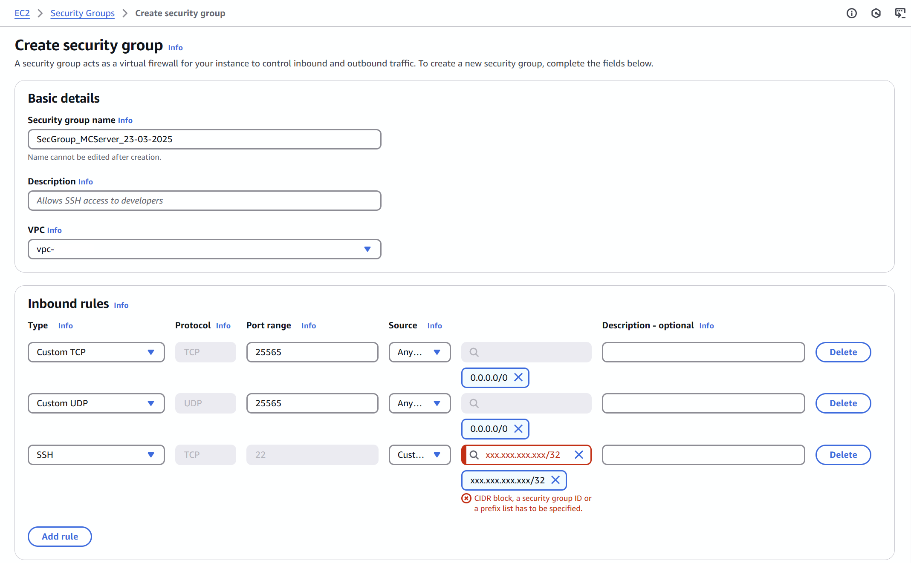
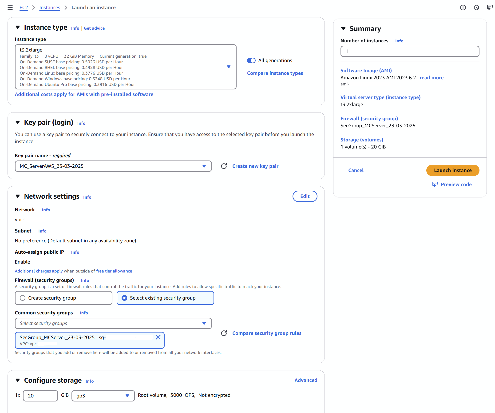
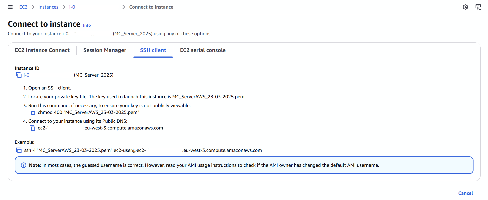
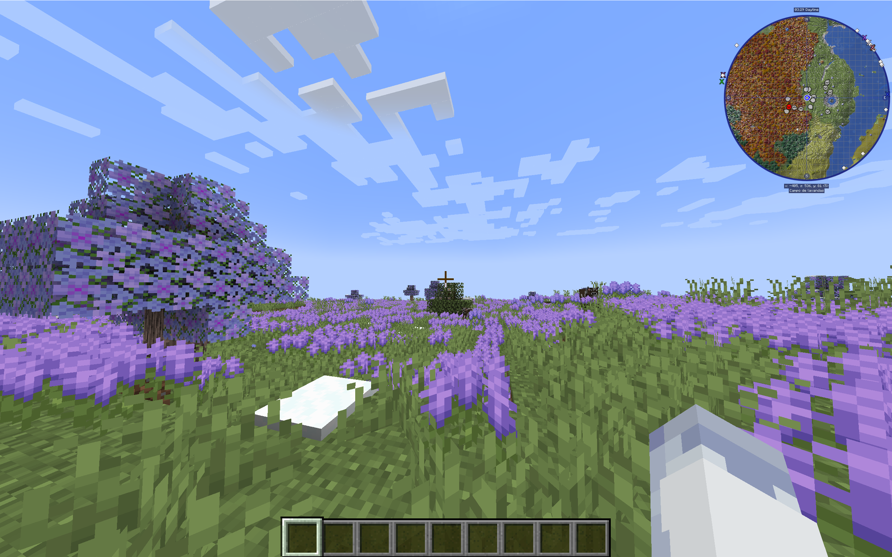

# AWS EC2 for setting up a private Minecraft moded (Forge) server

## Introduction
This repository is a guide for everyone who wants to set up their private Minecraft Forge server (also for me to remember the, allways forgotten, steps). We are going to use AWS EC2 to host the server.

## Index
1. [Game version and Mod List](#1-Game-Version-and-Mod-List)
2. [On-Demand vs Spot Instance](#On-Demand-vs-Spot-Instance)
3. [Choosing an Instance Type](#Choosing-an-Instance-Type)
4. [Instance Set-Up](#Instance-Set-Up)
  41. [Name your instance](#Name-your-instance)
  42. [Choose an AMI](#Choose-an-AMI-(Amazon-Machine-Image))
  43. [Choose an instance type](#Choose-an-instance-type)
  44. [Create a key pair](#Create-a-key-pair)
  45. [Set up the security group](#Set-up-the-security-group)
  46. [Configure the storage](#Configure-the-storage)
5. [Connect via SSH](#Connect-via-SSH)
6. [Java and Forge Installation](#Java-and-Forge-Installation)
7. [Server Configuration and Mods](#Server-Configuration-and-Mods)
8. [Minecraft Local Instalation and Settings](#Minecraft-Local-Instalation-and-Settings)
9. [Connecting to the Server](#Connecting-to-the-Server)
10. [Server Usefull Commands](#Server-Usefull-Commands)
<br></br>

## 1 - Game Version and Mod List
The first step is choosing the game version and all the mods you want to use in-game. In our case, we are going to play with **Forge 1.20.1-47.2.20** because it's a stable version and there is a large variety of mods available. 

Check here for all the Forge versions, and also here is the webpage where we download all the mods (**CurseForge**):
- **[Forge](https://files.minecraftforge.net/net/minecraftforge/forge/)**
- **[CurseForge - Mods](https://www.curseforge.com/minecraft)**

Additionaly I'm going to share all the mods that we are using in our latest server:  


Once you have chosen the version and all the mods, you need to decide your **budget** and how many players will join. This is important because AWS offers various types of virtual machines, and you need to choose one that fits your requirements.  
If you're planning to play with 200 mods and multiple players, you should pick a more powerful instance. We’ll discuss and compare the different options in the next section.

AWS offers an incredible number of services. For this project, we are going to use **EC2 instances** to host our Minecraft server. EC2 has a whole ecosystem around it, starting with the dashboard: 


The resources we’re going to use are:  
- **Instances**  
- **Volumes**  
- **Key Pairs**  
- **Security Groups**

> [!NOTE]
> I'm not an expert in AWS ecosystem, if i did wrong one step or i have an incorrect configuration please contact with me (ipasauriz@gmail.com) and I will correct the mistake. Additionaly I erased all the sensible data for my privacy, dont be surprised if in an image is missing certain data. Thank you.
<br></br>

## 2 - On-Demand vs Spot Instance
First of all, let’s discuss which purchase model you should choose for your instance. You have to decide whether you want to use an **On-Demand** or a **Spot Instance**. The difference between them is the following:

- **On-Demand Instances** are for applications that **cannot be interrupted**. You can run the server 24/7 without any problems. Additionally, On-Demand instances allow you to **start and stop the instance whenever you want**, so you have **full control** over your server and usage.

- **Spot Instances**, on the other hand, let you **take advantage of unused EC2 capacity** at a much lower price. However, AWS can **shut down your instance at any time** if that capacity is needed elsewhere — you'll receive a 2-minute warning before it's terminated.  
  The downside is that **you can’t start or stop Spot Instances manually** unless you set up complex automation. They're more suited for services that run continuously, like a 24h/day server without manual control.

In our case, we decided to go with **On-Demand Instances**. Even though Spot Instances are significantly cheaper, for example a `t3.2xlarge` instance we would pay **$0.3328/hour On-Demand** vs **$0.0966/hour Spot** I prefer having **full control over the server's active hours**.  

|  |  |
|-----------------------------|-----------------------------|

We don’t need the server running all day, especially if no one is playing — that would just waste money on unused time. If you prefer to have the server available 24/7 and want to save money, **Spot Instances** might be a better fit.  
It really depends on your group’s **play style, schedule, and budget**.
<br></br>


## 3 - Choosing an Instance Type
Next, you need to decide which instance type best fits your server needs.  
From my experience, for a server with around **100 mods** and **2–4 players playing at the same time**, a `t3.xlarge` is usually enough.  
For smaller servers, `t3.large` or even `t3.medium` will work perfectly and are more affordable.

One great advantage of using EC2 is that **you only pay for the hours you use**.  
So if you try one instance type and it’s not powerful enough, it’s easy to stop it and set up another one with better specs — without wasting much money.

In our case, we’re going to use a `t3.2xlarge` instance, which provides **8 vCPUs and 32 GiB of RAM**.  
This is because in previous servers, we tested a `t3.xlarge` (4 vCPUs and 16 GiB RAM), and we noticed that it wasn’t powerful enough to handle all the mods and the players smoothly.  

This time, we’ve decided to **double the specs** since we’re running **more than 100 mods** and expect **5–10 players**.
<br></br>


## 4 - Instance Set-Up
In the **EC2 Dashboard**, go to the **Instances** section on the left-side panel, then click on **“Launch Instances”** to begin the configuration process for your server.

<!--  -->

### 4.1 - Name your instance
Start by giving your instance a name — in our case, we’ll name it **MCServer_AWS**.

### 4.2 - Choose an AMI (Amazon Machine Image)
Next, select an **AMI**, which is the template for the operating system that will be installed on your server.  
For our purpose, a clean Linux distribution is enough — we’ll use **Amazon Linux 2023 AMI**.

Make sure the **architecture** is set to **64-bit (x86)**:


### 4.3 - Choose an instance type
Select the instance type that fits your needs. In our case, we’ll use a **t3.2xlarge**, disccused previously in the section [Choosing an Instance Type](#Choosing-an-Instance-Type), which offers 8 vCPUs and 32 GiB RAM.

### 4.4 - Create a key pair
You’ll need a key pair to connect to your server via SSH.

Click on **“Create new key pair”**, give it a name, and choose the **.pem** format (required for MobaXterm or similar SSH tools).  
Download the key to your computer and **store it safely**, as you’ll need it every time you connect to the instance:


### 4.5 - Set up the security group
The **security group** acts like a firewall and controls who can access your server.

Go to the **EC2 Dashboard**, scroll to the **“Network & Security”** section on the left, and open **Security Groups**.  
Click on **“Create security group”**:


You’ll need to add the following **inbound rules**:

**Allow TCP and UDP traffic** on port **25565** from **any IPv4 address** (`0.0.0.0/0`) — this is the default port for Minecraft.

**Allow SSH (TCP port 22)** only from your current **public IP address** — this is required to connect to the server via terminal (SSH).

You can find your public IP at [whatismyip.com](https://www.whatismyip.com).



If you have a public variable IP like me, take care that maby one day you cant connect to it because of this rule, you only need to acces again and edit the rule with your new public IP.

Once saved, return to the instance launch configuration — the new security group should appear in the list of available options.

### 4.6 - Configure the storage
Under the **"Configure Storage"** section, change the root volume size from **8 GiB to 20 GiB**.

While this increases the cost slightly (around **$2/month**), it’s important for a proper server setup. If your world is small and you’re only using ~20 mods, 8 GiB may be enough.

However, in our case, the previous server folder reached **10 GiB**, including the map, mods, and other files — and we don’t want to run out of space mid-way through the server.



Once all this is configured, you can launch your instance and move on to the next steps: installing Java, setting up the Minecraft server files, and opening the world!
<br></br>


## 5 - Connect via SSH
After launching the instance, wait a few minutes for it to finish setting up. Once it’s ready, go to the **Instances** section and you should see your new server running:


Select the instance and click on the **"Connect"** button in the top bar. In the **SSH client** section, AWS will show you an example command to connect via SSH using the `.pem` key file you downloaded earlier:



Copy that command and open **MobaXterm** (or any other SSH terminal) on your local machine. Paste the command into the terminal and voilà — you're in!


Just make sure that when you run the command you are **in the same folder as your `.pem` file** or you specify the **full path** where is your `.pem` file.
<br></br>


## 6 - Java and Forge Installation
Its crucial for Minecraft to have Java installed beforehand. To install Java 17, use the following command:

```bash
sudo yum install java-17-amazon-corretto -y
java -version
```


Once Java is installed, we need to upload the Forge installer to the server. With MobaXterm, this is very easy because just right-clicking on the left-hand panel inside your server directory, selecting Upload, and choosing the Forge installer file from your local machine, is enought to upload or download any file and folder in your server.


If you prefer using the terminal, here is how to do it with scp:

```bash
mkdir MCServer && cd MCServer
scp -i C:\Users\YourUser\Downloads\MC_ServerAWS.pem C:\Users\YourUser\forge-1.20.1-47.2.20-installer.jar ec2-user@18.234.12.34:/home/ec2-user/MCServer
```
(Be sure to replace the paths and IP address with your actual values.)


Next, run the Forge installer to set up the server files:

```bash
java -jar forge-1.20.1-47.2.20-installer.jar --installServer
```


## 7 - Server Configuration and Mods
Once the server files are installed, you should edit the `user_jvm_args.txt` file to adjust the memory settings. These values define the **maximum amount of RAM** the server can use. Depending on your EC2 instance type, you may need to allocate more or less. For example, if your instance has **8 GiB of RAM**, you should assign around **5–6 GiB** to avoid overloading the system.
In our case, since we have **32 GiB available**, we assign **28 GiB**:

```bash
sudo nano user_jvm_args.txt
```


Next, change the execution permissions of the `run.sh` file and execute it. This file acts as the launcher, and you will use it every time you want to start the server: 

```bash
sudo chmod +x run.sh
./run.sh
```

After launching the server for the first time, several new files and directories will be created, including a file called `eula.txt`. Before the server can fully start you need to accept the EULA by edditing the file and setting:

```bash
sudo nano eula.txt
eula=true
```


Before launching the server again, we need to add all the mods to the mods/ directory. If you’re using MobaXterm, the easiest way is to right-click on the left panel, select “Upload”, and choose all the mods you want to send.
Alternatively, here is how to do it via terminal:

```bash
cd mods
scp -i C:\Users\YourUser\Downloads\MC_ServerAWS.pem C:\Users\YourUser\Downloads\mods.zip ec2-user@18.234.12.34:/home/ec2-user/MCServer/mods
unzip mods.zip
```


Optionally, you can edit the `server.properties` file to customize server behavior — such as the number of players, world seed, difficulty, game mode, view distance, etc. For a better understanding, you can check the full documentation here: **[https://minecraft.fandom.com/wiki/Server.properties](https://minecraft.fandom.com/wiki/Server.properties)**


Now it’s time to start the server for real. Use the following command:

```bash
./run.sh
```

Wait a few seconds or minutes for the server to fully initialize. Once it's up, your terminal becomes the live console, where you’ll see commands, logs, chat messages, player activity, and everything that happens in the game in real time.


## 8 - Minecraft Local Instalation and Settings
Each player who wants to play on the server needs to follow these steps, as everyone must have the same mods as the server. If you already know how to install mods locally, feel free to skip this part.

First, just like on the server, you need to check if you have **Java** installed. If not, you can download the latest version here: **[https://www.java.com/download/](https://www.java.com/download/)**

Next, install **Forge**. Double-click on the Forge installer and select **Install Client** (it will automatically set the default `.minecraft` directory).


Once Forge is installed, open the **Minecraft launcher**. You will see a new **Forge version** under the "Installations" tab. 
Click on the "Installations" tab at the top, and then **edit** the Forge version. Click on **More Options**, and in the **JVM Arguments** section, replace `-Xmx2G` with a **reasonable RAM value** for your local machine.

|  |  |
|-----------------------------|-----------------------------|


To check how much RAM your machine has, open **Task Manager**, go to the **Performance** tab, and check the **Memory** section. Just like on the server, if you have **16 GiB of RAM**, allocate around **10 GiB** to avoid overloading your machine.


Once done, save the changes, and you’re ready to start the game!

## 9 - Connecting to the Server
Now, in **Minecraft's Multiplayer** section, click **Add Server**. In the **Server Address** section, enter the public IP of your server. 

To get this, go back to the **AWS EC2 Dashboard** and locate the **Public IPv4 Address**. This is the IP address you'll need to share with your friends.


Once you have the IP, go back to **Minecraft**, enter it, and try to connect to the server.

And that’s it! You should now be connected to your **Amazon-hosted Minecraft server**! 
I hope you enjoyed the tutorial. If you have any questions or need assistance, feel free to contact me (ipasauriz@gmail.com).

|  |  |
|-----------------------------|-----------------------------|

## 10 - Server Usefull Commands
```bash
Start the server -> ./run.sh
Stop the server -> /stop
Operator mode -> /op yournickname
Player list -> /list
All the commands -> /help
``` 